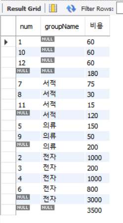

## 1. SELECT문

## 1.1 원하는 데이터를 가져와 주는 기본적인 <SELECT ... FROM>

### SELECT 구문 형식

```shell
SELECT
    [ALL | DISTINCT | DISTINCTROW ]
    [HIGH_PRIORITY]
    [STRAIGHT_JOIN]
    [SQL_SMALL_RESULT] [SQL_BIG_RESULT] [SQL_BUFFER_RESULT]
    [SQL_NO_CACHE] [SQL_CALC_FOUND_ROWS]
    select_expr [, select_expr] ...
    [into_option]
    [FROM table_references
      [PARTITION partition_list]]
    [WHERE where_condition]
    [GROUP BY {col_name | expr | position}, ... [WITH ROLLUP]]
    [HAVING where_condition]
    [WINDOW window_name AS (window_spec)
        [, window_name AS (window_spec)] ...]
    [ORDER BY {col_name | expr | position}
      [ASC | DESC], ... [WITH ROLLUP]]
    [LIMIT {[offset,] row_count | row_count OFFSET offset}]
    [into_option]
    [FOR {UPDATE | SHARE}
        [OF tbl_name [, tbl_name] ...]
        [NOWAIT | SKIP LOCKED]
      | LOCK IN SHARE MODE]
    [into_option]

into_option: {
    INTO OUTFILE 'file_name'
        [CHARACTER SET charset_name]
        export_options
  | INTO DUMPFILE 'file_name'
  | INTO var_name [, var_name] ...
}

```

많이 사용하는 SELECT문 형태

```shell
SELECT
    [FROM table_references
    [WHERE where_condition]
    [GROUP BY {col_name | expr | position}, ... [WITH ROLLUP]]
    [HAVING where_condition]
    [ORDER BY {col_name | expr | position}
```

가장 많이 사용하는 SELECT문 형태

```shell
SELECT 열 이름
FROM 테이블 이름
WHERE 조건
```

### USE 구문

- 사용할 데이터베이스 지정

```shell
USE 데이터베이스_이름;
```

예를 들어 employees 데이터베이스를 사용하기 위해서는 다음과 같이 사용할 수 있습니다.

```shell
USE employees;
```

### SELECT와 FROM

```shell
SELECT * FROM 테이블명
```

예를 들어 titles 테이블의 있는 모든 데이터를 검색하고자 하는 경우 다음과 같이 사요할 수 있습니다.

```shell
SELECT * FROM titles;
```

테이블에서 전체 열이 아닌 필요로 하는 열만 가져오는 경우 다음과 같이 사용할 수 있습니다.

```shell
SELECT first_ame FROM employees;
```

## 1.2 특정한 조건의 데이터만 조회하는 <SELECT ... FROM ... WHERE>

WHERE 절은 조회하는 결과에 특정한 조건을 줘서 원하는 데이터만 보고 싶을때 사용합니다.

### 기본적인 WHERE 절

기본적인 WHERE 절 형식은 다음과 같습니다.

```shell
SELECT 필드이름 FROM 테이블이름 WHERE 조건식;
```

예를 들어 이름이 '김경호'인 사람의 데이터를 보고 싶다면 다음과 같이 조건식을 줄 수 있습니다.

```shell
SELECT * FROM usertbl WHERE name = '김경호';
```

### 관계 연산자의 사용

관계 연산자의 형식은 다음과 같습니다.

```shell
SELECT 필드이름 FROM 테이블이름 WHERE 조건식 관계연산자(AND, OR, NOT) 조건식 [관계연산자 조건식]...;
```

예를 들어 1970년 이후에 출생하고 신장이 182 이상인 사람의 아이디와 이름을 조회한다고 하면 다음과 같이 사용할 수 있습니다.

```shell
SELECT userID, Name FROM usertbl WHERE birthYear >= 1970 AND height >= 182;
```

### BETWEEN ... AND와 IN() 그리고 LIKE

#### BETWEEN 명령어 형식

```shell
SELECT 필드이름 FROM 테이블이름 WHERE 컬럼명 BETWEEN A AND B
```

예를 들어 키가 180~183인 사람을 조회한다고 할 경우 다음과 같이 사용할 수 있습니다.

```shell
SELECT name, height FROM usertbl WHERE height BETWEEN 180 AND 183;
```

#### IN 명령어 형식

```shell
SELECT 필드이름 FROM 테이블이름 WHERE 컬럼명 IN ('값1', '값2', ..., '값N')
```

예를 들어 지역이 '경남', '전남', '경북'인 사람을 검색할때 다음과 같이 사용할 수 있습니다.

```shell
SELECT name, addr FROM usertbl WHERE addr IN ('경남', '전남', '경북');
```

### LIKE 명령어 형식

```shell
SELECT 필드 이름 FROM 테이블이름 WHERE 컬럼명 LIKE '패턴';
```

LIKE 패턴에서 '%', '_' 와일드카드를 사용한 패턴 예제는 다음과 같습니다.

| like 연산자               | 설명                                                             |
|------------------------|----------------------------------------------------------------|
| WHERE name LIKE '김%'   | '김'으로 시작하는 이름                                                  |
| WHERE name LIKE '%환'   | '환'으로 끝나는 이름                                                   |
| WHERE name LIKE '%용%'  | '용'을 포함하는 이름                                                   |
| WHERE name LIKE '_용%'  | 앞에 한글자가 오고 두번째는 '용' 세번째 글자 이후는 아무 값이나 오는 값을 필터링합니다.            |
| WHERE name LIKE '김_%'  | '김'으로 시작하고 두번째는 한글자, 세번째 글자 이후는 아무 값이나 오는 값을 필터링합니다.           |
| WHERE name LIKE '김__%' | '김'으로 시작하고 두번째는 한글자, 세번째도 한글자, 네번재 글자 이후는 아무 값이나 오는 값을 필터링합니다. |
| WHERE name LIKE '김%환'  | '김'으로 시작하고 '환'으로 끝나는 이름을 필터링합니다. 두번째는 길이제한이 없습니다.              |

## ANY/ALL/SOME 그리고 서브쿼리(SubQuery, 하위쿼리)

### 서브쿼리

서브쿼리란 쿼리문 안에 쿼리문이 있는 쿼리입니다.

예를 들어 김경호보다 키가 크거나 같은 사람의 이름과 키를 출력합니다.

```shell
SELECT name, height FROM usertbl
WHERE height > (SELECT height FROM usertbl WHERE Name = '김경호');
```

### ANY

ANY는 서브 쿼리의 여러 개의 결과 중 한가지만 만족해도 되는 조건식입니다.

#### 명령어 형식

```shell
SELECT 컬럼명
FROM 테이블명
WHERE 컬럼명 >= ANY (서브쿼리)
```

예를 들어 지역이 '경남' 사람의 키보다 키가 크거나 같은 사람을 검색합니다.

```shell
SELECT name, height FROM usertbl
WHERE height >= ANY (SELECT height FROM usertbl WHERE addr = '경남');
```

- 경남인 사람인 김범수(키 173)와 윤종신(키 170)이므로 최소 키가 170보다 크거나 같은 사람이 검색됩니다.

### ALL

ALL은 서브 쿼리의 여러 개의 결과 중 모두를 만족해야 되는 조건식입니다.

#### 명령어 형식

```shell
SELECT 컬럼명
FROM 테이블명
WHERE 컬럼명 >= ALL (서브쿼리)
```

예를들어 지역이 '경남' 사람의 키보다 키가 크거나 같은 사람을 검색합니다.

```shell
SELECT name, height FROM usertbl
WHERE height >= ANY (SELECT height FROM usertbl WHERE addr = '경남');
```

- 경남인 사람인 김범수(키 173)와 윤종신(키 170)이므로 최소 키가 173보다 크거나 같은 사람이 검색됩니다.

## 원하는 순서대로 정렬하여 출력: ORDER BY

ORDER BY 절은 결과물에 대해 영향을 미치지는 않지만, 결과가 출력되는 순서를 조잘하는 구문입니다.

#### 명령어 형식

```shell
SELECT 컬럼명
FROM 테이블명
ORDER BY 컬럼명 [ASC|DESC]
```

- ASC : 오름차순 (기본값)
- DESC : 내림차순

예를 들어 회원 검색시 먼저 가입한 순서로 회원들을 검색하고자 하는 경우 다음과 같이 사용할 수 있습니다.

```shell
SELECT name, mDate
FROM usertbl
ORDER BY mDate;
```

- 날짜 같은 경우 오름차순으로 정렬시 제일 오래된 날짜가 제일 앞으로 옵니다.
- ORDER BY 절에서 컬럼명만 쓰는 경우 기본적으로 ASC 오름차순으로 됩니다.

만약 컬럼명이 동일한 경우 2차 기준을 설정할 수 있습니다.

예를 들어 키가 큰 순서대로 정렬하되 키가 같을 경우 이름 순으로 정렬하려면 다음과 같이 사용할 수 있습니다.

```shell
SELECT name, height
FROM usertbl
ORDER BY height DESC, name ASC;
```

### 중복된 것은 하나만 남기는 DISTINCT

DISTINCT는 중복값을 제거하여 출력해주는데 사용합니다.

#### 명령어 형식

```shell
SELECT DISTINCT 컬럼명
FROM 테이블명;
```

에를 들어 회원들의 지역을 출력한다고 할 경우 다음과 같이 사용할 수 있습니다.

```shell
SELECT DISTINCT addr
FROM usertbl;
```

### 출력하는 개수를 제한하는 LIMIT

LIMIT는 출력되는 데이터의 개수를 제한하는데 사용됩니다.

#### 명령어 형식

```shell
SELECT 컬럼명
FROM 테이블명
LIMIT [값1 | 값1, 값2 | 값1 OFFSET 값2]
```

- 값1, 값2 : 값1만큼 스킵하고 값2만큼 출력합니다.
    - ex) LIMIT 0, 5 : 개수를 0개만큼 스킵하고 5개만큼 출력합니다.
- 값1 OFFSET 값2 : 값1, 값2 형식과 마찬가지로 값2 만큼 스킵하고 값1 개수만큼 출력합니다.
    - ex) LIMIT 5 OFFSET 0 : 개수를 0개만큼 스킵하고 5개만큼 출력합니다.

예를 들어 입사일이 오래된 직원 5명의 사원번호를 알고 싶다면 다음과 같이 사용합니다.

```shell
SELECT emp_no, hire_date
FROM employees
ORDER BY hire_date
LIMIT 5;
```

## 테이블을 복사하는 CREATE TABLE ... SELECT

CREATE TABLE ... SELECT 구문은 테이블을 복사해서 사용할 경우에 주로 사용됩니다.

#### 명령어 형식

```shell
CREATE TABLE 새로운테이블 (SELECT 복사할 컬럼명 FROM 기존테이블)
```

예를 들어 buytbl 테이블을 buytbl2로 복사합니다.

```shell
CREATE TABLE buytbl2 (SELECT * FROM buytbl);
```

다음과 같이 특정 컬럼만을 대상으로 복사할 수 있습니다.

```shell
CREATE TABLE buytbl3 (SELECT userID, prodName FROM buytbl);
```

주의 : 복사한 테이블은 기본키나 외래키 제약조건까지 복사되지 않습니다.

## 1.3 GROUP BY 및 HAVING 그리고 집계 함수

### GROUP BY절

#### GROUP BY 명령어 형식

```shell
select 컬럼명
  [FROM 테이블명]
  [WHERE 조건식]
  [GROUP BY {컬럼명 | 표현식 | 위치(Position)]
  [HAVING 조건식]
  [ORDER BY {컬럼명 | 표현식 | 위치(Position)}]
```

예를 들어 구매 테이블(buytbl)에서 사용자(userID)가 구매한 물품의 개수(amount)를 보려면 다음과 같이 사용할 수 있습니다.

```shell
SELECT userID, SUM(amount) FROM buytbl GROUP BY userID;
```

다른 예시로 이번에는 구매액의 총합을 알고자 하는 경우 다음과 같이 사용할 수 있습니다. 구매액은 가격 * 수량입니다.

```shell
SELECT userID AS '사용자 아이디', SUM(price * amount) AS '총 구매액'
FROM buytbl
GROUP BY userID;
```

### 집계함수

| 함수명             | 설명                  |
|-----------------|---------------------|
| AVG()           | 평균을 구합니다.           |
| MIN()           | 최소값을 구합니다.          |
| MAX()           | 최댓값을 구합니다.          |
| COUNT()         | 행의 개수를 셉니다.         |
| COUNT(DISTINCT) | 중복되지 않은 행의 개수를 셉니다. |
| STDEV()         | 표준편차를 구합니다.         |
| VAR_SAMP()      | 분산을 구합니다.           |

예를 들어 전체 구매자가 구매한 물품의 개수의 평균을 구하면 다음과 같이 사용할 수 있습니다.

```shell
SELECT AVG(amount) AS '평균 구매 개수'
FROM buytbl;
```

각 사용자 별로 한번 구매시 물건을 평균 몇개 구매했는지 평균을 내봅니다.

```shell
SELECT userID, AVG(amount) AS '평균 구매 개수'
FROM buytbl
GROUP BY userID;
```

가장 큰 키와 가장 작은 키의 회원 이름과 키를 출력합니다.

```shell
SELECT name, height
FROM buytbl
GROUP BY height = (SELECT MAX(height) FROM usertbl)
  OR height (SELECT MIN(height) FROM usertbl);
```

휴대폰이 있는 사용자의 수를 출력합니다.

```shell
SELECT COUNT(mobile1) as '휴대폰이 있는 사용자'
FROM usertbl;
```

### HAVING절

HAVING 절은 WHERE와 비슷한 개념으로 조건을 제한하는 것이지만 집계 함수에 대해서 조건을 제한합니다.

HAVING 절은 GROUP BY 절 다음에 나와야 합니다. 순서가 바뀌면 안됩니다.

예를 들어 사용자별 총 구매액을 구하는데 총 구매액이 1000 초과인 경우만 출력하는 경우 다음과 같이 사용할 수 있습니다.

```shell
SELECT userID AS '사용자', SUM(price * amount) AS '총 구매액'
FROM buytbl
GROUP BY userID
HAVING SUM(price * amount) > 1000;
```

### ROLLUP

총합 또는 중간 합계가 필요하다면 GROUP BY 절과 함께 WITH ROLLUP 문을 사용하면 됩니다.

예를 들어 분류(groupName) 별로 합계 및 그 총합을 구하고 싶다면 다음의 구문을 사용합니다.

```shell
SELECT num, groupName, SUM(price * amount) AS '비용'
FROM buytbl
GROUP BY groupName, num
WITH ROULLUP;
```



- 중간에 num열이 NULL로 되어있는 추가된 행이 각 그룹의 소합계를 의미합니다.
- 마지막 행은 각 소합계의 합계, 즉 총합계의 결과가 됩니다.

### 1.4 SQL 분류

#### DML

- DML(Data Manipulation Language)은 데이터를 조작(선택, 삽입, 수정, 삭제)하는데 사용되는 언어입니다.
- SQL 문 중에 SELECT, INSERT, UPDATE, DELETE가 이 구문에 해당합니다.
- 트랜잭션이 발생하는 SQL도 DML입니다.
    - 트랜잭션이란 테이블의 데이터 변경(입력/수정/삭제)할때 실제 테이블에 완전히 적용하지 않고, 임시로 적용시키는 것을 의미합니다.
    - 실수가 있었을 경우에 임시로 적용시킨 것을 취소 시킬 수 있게 해줍니다.

#### DDL

- DDL(Data Definition Language)은 데이터베이스, 테이블, 뷰, 인덱스 등의 데이터베이스 개체를 생성/삭제/변경하는 역할을 합니다.
- 대표적인 DDL 구문은 CREATE, DROP, ALTER
- DDL은 트랜잭션을 발생시키지 않습니다.
- DDL은 실행 즉시 MySQL에 반영됩니다.

#### DCL

- DCL(Data Control Language)은 사용자에게 어떤 권한을 부여하거나 빼앗을 때 사용하는 구문입니다.
- 대표적인 DCL 구문은 GRANT/REVOKE/DENY 등이 이에 해당합니다.

## 2. 데이터의 변경을 위한 SQL문

### 2.1 데이터의 삽입 : INSERT

### INSERT문 기본

```shell
INSERT [INTO] 테이블[(열1, 열2, ...)] VALUES("값1", "값2", ...)
```

- 테이블 이름 다음에 나오는 열은 생략이 가능합니다.
- 테이블 이름 다음에 나오는 열을 생략하는 경우 VALUES 다음에 나오는 값들의 순서 및 개수가 테이블이 정의된 열 수선 및 개수와 동일해야 합니다.

```shell
CREATE TABLE testTbl1 (
  id int,
  usename char(3),
  age int
);
  
INSERT INTO testTbl1 VALUES(1, '홍길동', 25);
```

위의 예제에서 이름만 입력하고 싶다면 다음과 같이 테이블 이름 뒤에 입력할 열의 목록을 나열해줘야 합니다.

```shell
INSERT INTO testTbl1(id, username) VALUES(1, '홍길동');
```

- 생략한 age는 NULL이 입력됩니다.

### 자동으로 증가하는 AUTO_INCREMENT

- AUTO_INCREMENT는 자동으로 1부터 증가하는 값을 입력해줍니다.
- AUTO_INCREMENT 지정시 반드시 PRIMARY KEY 또는 UNIQUE로 지정해야합니다.
- AUTO_INCREMENT로 지정한 컬럼 타입은 숫자 형식만 사용할 수 있습니다.
- AUTO_INCREMENT로 지정한 열은 INSERT문에서 NULL 값 지정시 자동으로 값이 입력됩니다.

```shell
use sqldb;
CREATE TABLE testTbl2(
  id int AUTO_INCREMENT PRIMARY KEY,
  username char(3),
  age int
);

INSERT INTO testTbl2 VALUES (NULL, '지민', 25);
INSERT INTO testTbl2 VALUES (NULL, '유나', 24);
INSERT INTO testTbl2 VALUES (NULL, '유경', 23);
```

#### 현재 증가된 숫자 확인 : LAST_INSERT_ID()

```shell
SELECT LAST_INSERT_ID();
```

#### AUTO_INCREMENT 입력값 변경

자동 입력되는 값을 특정 숫자 이후부터 증가시키고 싶다면 AUTO_INCREMENT 입력값을 변경할 수 있습니다.

```shell
ALTER TABLE testTbl2 AUTO_INCREMENT=100;
INSERT INTO testTbl2 VALUES (NULL, '찬미', 23);
SELECT * FROM testTbl2;
```

#### AUTO_INCREMENT 증가값 변경

한 데이터가 삽입될때마다 입력값이 특정 값만큼 증가하고 싶다면 AUTO_INCREMENT 증가값을 수정할 수 있습니다.

```shell
USE sqldb;
CREATE TABLE testTbl3(
  id int AUTO_INCREMENT PRIMARY KEY,
  userName char(3),
  age int
);

ALTER TABLE testTbl3 AUTO_INCREMENT = 1000;

SET @@auto_increment_increment = 3;

INSERT INTO testTbl2 VALUES (NULL, '지민', 25);
INSERT INTO testTbl2 VALUES (NULL, '유나', 24);
INSERT INTO testTbl2 VALUES (NULL, '유경', 23);
```

### 대량의 샘플 데이터 생성

```
INSERT INTO 테이블이름(열이름1, 열이름2, ...)
SELECT문;
```

- SELECT 문의 결과 열의 개수는 INSERT를 할 테이블의 열 개수와 일치해야 한다.

예를 들어 직원들의 정보를 testTbl4 테이블에 넣는 쿼리는 다음과 같습니다.

```shell
USE sqldb;
CREATE TABLE testTbl4(
  id int,
  Fname varchar(50),
  Lname varchar(50)
);
  
INSERT INTO testTbl4
SELECT emp_no, first_name, last_name
FROM employees.employees;
```

테이블 정의까지 생략하고 싶다면 `CREATE TABLE ... SELECT` 구분을 사용할 수 있습니다.

```shell
USE sqldb;
CREATE TABLE testTbl5 
(SELECT emp_no, first_name, last_name FROM employees.employees);
```

### 2.2 데이터의 수정 : UPDATE

#### UPDATE문 형식

```shell
UPDATE 테이블이름
SET 열1=값1, 열2=값2...
WHERE 조건;
```

- WHERE절 생략시 테이블의 전체의 행이 변경됩니다.

다음 예시는 'Kyoichi'의 Lname을 '없음'으로 변경하는 예시입니다.

```shell
UPDATE testTbl4
SET Lname = '없음'
WHERE Fname = 'Kyoichi';
```

### 2.3 데이터의 삭제 : DELETE FROM

테이블의 데이터를 삭제하는 DELETE문은 다음과 같은 형식을 가지고 있습니다.

```shell
DELETE FROM 테이블명 WHERE 조건;
```

- WHERE문이 생략시 전체 데이터를 삭제합니다.

예를 들어 testTbl4 테이블에서 'Aamer' 사용자가 필요없다면 다음과 같은 구문을 사용하면 됩니다.

```shell
USE sqldb;
DELETE FROM testTbl4 WHERE Fname = 'Aamer';
```

- 실행 결과는 228건의 행이 삭제될 것입니다. 이유는 Fname이 'Aamer'를 가진 데이터가 228개이기 때문입니다.

### 2.4 조건부 데이터 입력, 변경

데이터 100건을 한번에 입력시 첫번째 한건이 기본키 중복으로 실패한다면 나머지 99건도 입력되지 않는 문제가 발생할 수 있습니다.

MySQL은 오류가 발생해도 계속 진행하는 방법을 제공합니다.

```shell
INSERT IGNORE INTO memberTBL VALUES ('BBK', '비비코', '미국');
INSERT IGNORE INTO memberTBL VALUES ('SJH', '서장훈', '서울');
INSERT IGNORE INTO memberTBL VALUES ('HJY', '현주엽', '경기');
```

## 3. WITH절과 CTE

### 3.1 WITH절과 CTE 개요

WITH절은 CTE(Common Table Expression)를 표현하기 위한 구문으로 MySQL 8.0 이후부터 사용할 수 있습니다.

**CTE는 기존의 뷰, 파생 테이블, 입시 테이블 등으로 사용되던 것을 대신**할 수 있습니다. CTE는 더 간결한 식으로 보여지는 장점이 있습니다.

### 3.2 비재귀적 CTE

비재귀적 CTE는 말 그대로 재귀적이지 않은 CTE입니다. 단순한 형태이며, 복합한 쿼리문장을 단순화시키는데 사용도리 수 있습니다.

비재귀적 CTE 형식은 다음과 같습니다.

```
WITH CTE_테이블이름(열 이름)
AS
(
  <쿼리문>
)
SELECT 열이름 FROM CTE_테이블이름;
```

- 비재귀적 CTE에는 **SELECT 필드를 FROM CTE_테이블이름** 구문 외에 UPDATE 등도 가능하지만 주로 사용되는 것은 SELECT문입니다.
- 위쪽을 떼고 **SELECT 열 이름 FROM CTE_테이블이름** 구문만 생각해도 됩니다.
- 이 테이블은 기존에는 실제 DB에 있는 테이블을 사용했지만 CTE는 바로 위의 WITH 절에서 정의한 CTE 테이블 이름을 사용하는것만 다릅니다.
- 즉, **WITH CTE_테이블이름(열이름) AS ...** 형식의 테이블이 하나 더 있다고 생각하면 됩니다.

예를 들어 buyTBL에서 총 구매액을 구하는 것을 다시 봅니다.

```shell
USE sqldb;
SELECT userid AS '사용자', SUM(price * amount) AS '총 구매액'
FROM buyTBL
GROUP BY userid;
```

위 결과에서 총 구매액이 많은 사용자 순서로 정렬하고 싶다면 어떻게 해야 할까요?

ORDER BY문을 추가해도 되지만 그러한 경우에 SQL문이 복잡해집니다.

그런데 위 결과가 바로 abc라는 테이블이라고 생각하면 어떨까요?

그렇다면 정렬하는 쿼리는 다음과 같이 간단해집니다.

```shell
SELECT *
FROM abc
ORDER BY 총구매액 DESC
```

쿼리문을 정리하면 다음과 같아집니다.

```shell
WITH abc(userid, total)
AS
(SELECT userid, SUM(price * amount)
  FROM buytbl GROUP BY userid)
SELECT * FROM abc ORDER BY total DESC;
```

- 제일 아래의 `FROM abc` 구문에서 abc는 실존하는 테이블이 아니라, WITH 구문으로 만든 SELECT의 결과입니다.

CTE는 다음과 형식과 같은 중복 CTE도 허용됩니다.

```shell
WITH
AAA (컬럼들)
AS ( AAA의 쿼리문),
  BBB (컬럼들)
    AS ( BBB의 쿼리문),
  CCC (컬럼들),
    AS ( CCC의 쿼리문)
SELECT * FROM [AAA 또는 BBB 또는 CCC]
```

- CCC의 쿼리문에서는 AAA나 BBB를 참조할 수 있지만, AAA의 쿼리문이나 BBB의 쿼리문에서는 CCC를 참조할 수 없습니다.
- 즉, 아직 정의되지 않은 CTE를 미리 참조할 수 없습니다.


