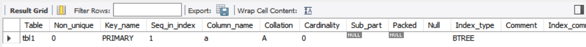
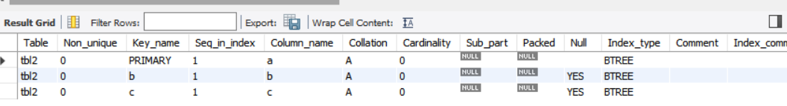
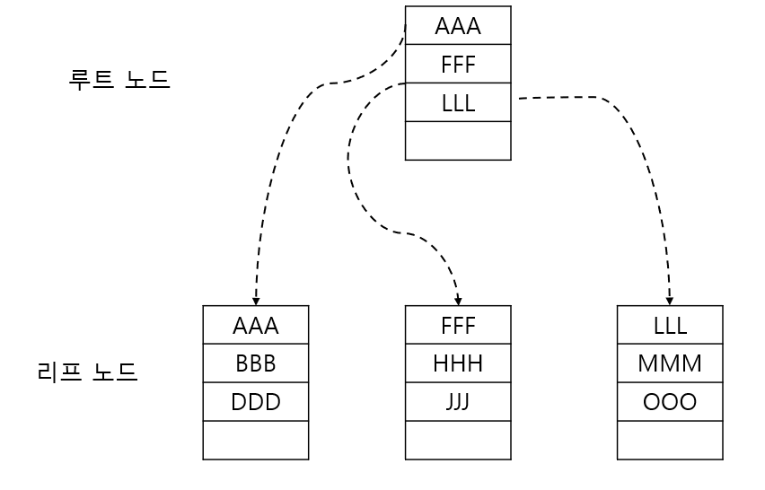
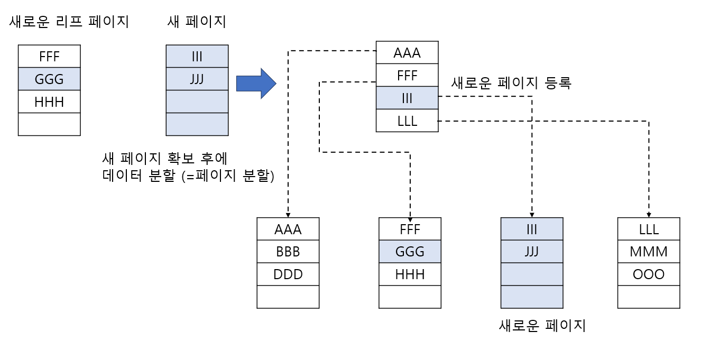
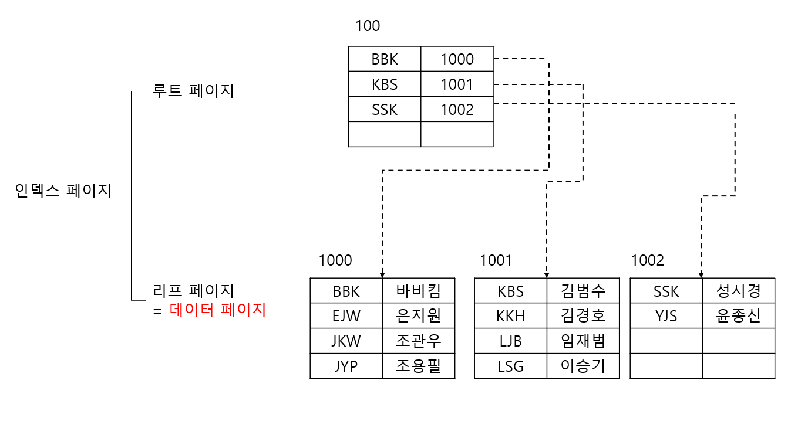
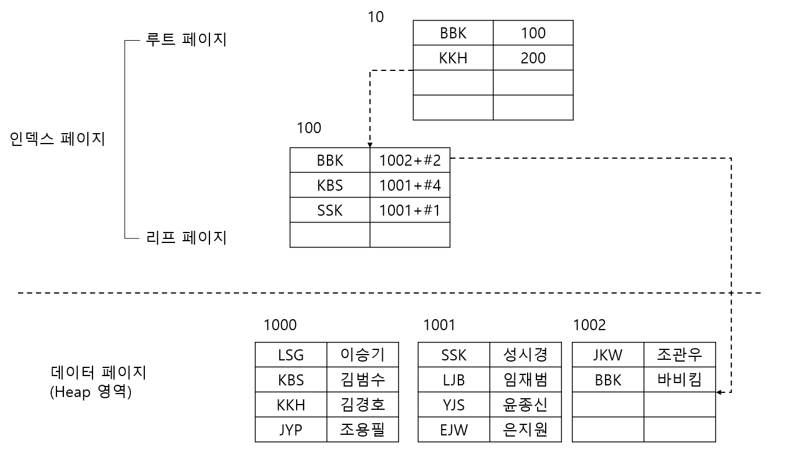
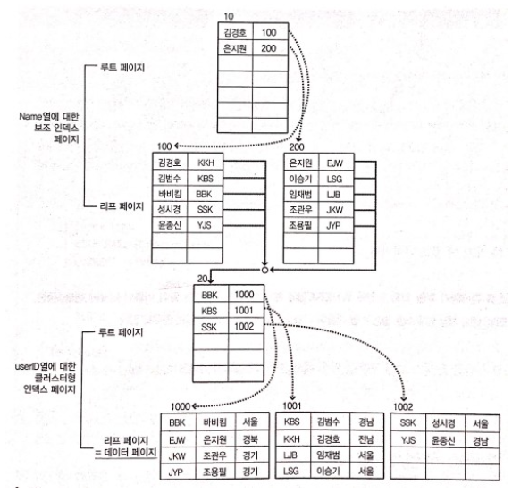
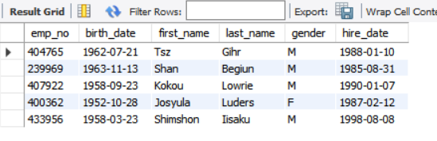
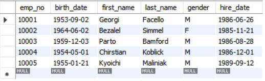
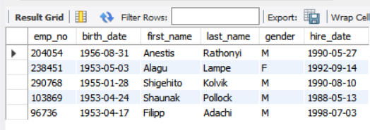

# 인덱스

## 1. 인덱스의 개념

- 인덱스는 데이터베이스에서 데이터 ㄱ머색과 조회를 빠르게 하기 위해 사용되는 자료 구조입니다.
- 인덱스는 테이블의 하나 이상의 열에 대한 키-값 쌍으로 구성됩니다.
- 각 키는 테이블의 행에 대응되며, 해당 행의 위치를 가리키는 포인터 역할을 합니다.

### 인덱스 장점

- 검색 속도가 무척 빨라질 수 있습니다.
- 인덱스 사용 결과 해당 쿼리의 부하가 줄어들어 시스템 전체의 성능이 향상될 수 있습니다.

### 인덱스 단점

- 인덱스가 데이터베이스 공간을 차지해서 추가적인 공간이 필요해지는데, 대략 데이터베이스 크기의 10% 정도의 추가 공간이 필요합니다.
- 처음 인덱스를 생성하는데 시간이 많이 소요될 수 있습니다.
- 데이터의 변경 작업이 자주 일어나는 경우에는 오히려 성능이 많이 나빠질 수 있습니다.

## 2. 인덱스의 종류와 자동 생성

### 2.1 인덱스의 종류

- 클러스터형 인덱스(Clustered Index)
    - 비유) 영어 사전
    - 정렬된 실제 데이터가 차례대로 있는 형태
- 보조 인덱스(Secondary Index)
    - 비유) 찾아보기
    - 실제 데이터가 있는 곳을 한번 더 찾아가는 형태

### 2.2 자동으로 생성되는 인덱스

- 테이블의 특정 열에 Primary Key를 설정시 클러스터형 인덱스가 생성됩니다.
- 테이블의 특정 열에 Unique를 설정시 보조 인덱스가 생성됩니다.

### 클러스터형 인덱스 생성

```mysql
USE sqldb;
CREATE TABLE tbl1
(
    a INT PRIMARY KEY,
    b INT,
    c INT
);
SHOW INDEX FROM tbl1;
```



위 실행 결과를 보면 a열에 유일한 인덱스가 생성되어 있는것을 확인할 수 있습니다.

Key_name이 PRIMARY로 된것은 클러스터형 인덱스를 의미합니다.

### 보조 인덱스 생성

테이블의 특정 열에 UNIQUE 제약 조건을 적용하여 보조 인덱스를 생성합니다.

```mysql
CREATE TABLE tbl2
(
    a INT PRIMARY KEY,
    b INT UNIQUE,
    c INT UNIQUE,
    d INT
);
SHOW INDEX FROM tbl2;
```



위 실행 결과를 보면 b, c열에 보조 인덱스가 자동으로 생성된 것을 확인할 수 있습니다.

### 정리

- `PRIMARY KEY`로 지정한 열은 클러스터형 인덱스가 생성됩니다.
- `UNIQUE NOT NULL`로 지정한 열은 클러스터형 인덱스가 생성됩니다.
- `UNIQUE`(또는 `UNIQUE NULL`)로 지정한 열은 보조 인덱스가 생성됩니다.
- `PRIMARY KEY`와 `UNIQUE NOT NULL`이 있으면 `PRIMARY KEY`로 지정한 열에 우선적인 클러스터형 인덱스가 생성됩니다.
- `PRIMARY KEY`로 지정한 열로 데이터가 오름차순 정렬됩니다.

## 9.3 인덱스의 내부 작동

### 9.3.1 B-Tree(Balanced Tree, 균형 트리)

- B-Tree는 인덱스를 표현할때 사용하는 자료구조이고 균형이 잡힌 트리입니다.
- 노드(Node) : 트리 구조에서 데이터가 존재하는 공간
- 루트 노드(Root Node) : 노드의 가장 상위 노드
- 리프 노드(Leaf Node) : 제일 마지막에 존재하는 노드
- MySQL에서 사용하는 노드 : 페이지
- 페이지 : 16Kbyte(16384 byte) 크기의 최소한의 저장 단위
- MySQL에서는 노드가 페이지가 되며 인덱스를 구현시 B-Tree 구조를 사용합니다.



예를 들어 MMM이라는 데이터를 조회시 루트 노드에서 3건, 리프 노드에서 2건 읽어서 총 5건의 데이터만 조회하면 MMM 데이터를 찾을 수 있습니다.

### 9.3.2 페이지 분할

인덱스 구성시 데이터의 변경 작업(INSERT/UPDATE/DELETE)시 성능이 나빠지는 단점을 가지고 있습니다.

다음은 B-Tree에 데이터가 삽입되어 페이지 분할이 발생하는 과정입니다.



### 9.3.3 클러스터형 인덱스와 보조 인덱스의 구조

클러스터형 인덱스를 구성한 후의 B-Tree 구조는 다음과 같습니다.



- 클러스터형 인덱스의 생성 시에는 데이터 페이지 전체가 다시 정렬됩니다.
- 클러스터형 인덱스는 인덱스 자체의 리프 페이지가 곧 데이터입니다.
- 클러스터형 인덱스는 보조 인덱스보다 검색 속도는 더 빠릅니다. 하지만 데이터의 입력/수정/삭제는 더 느립니다.
- 클러스터 인덱스는 성능이 좋지만 테이블에 한개만 생성할 수 있습니다. 그러므로 어느 열에 클러스터형 인덱스를 생성하는지에 따라서 시스템의 성능이 달라질 수 잇습니다.



- 보조 인덱스의 생성시에는 데이터 페이지는 그냥 둔 상태에서 별도의 페이지에 인덱스를 구성합니다.
- 보조 인덱스는 인덱스 자체의 리프 페이지는 데이터가 아니라 데이터의 위치하는 주소값(RID)입니다.
    - 클러스터형 보다 검색 속도는 느리지만, 데이터의 입력/ㅅ줭/삭제는 덜 느립니다.
- 보조 인덱스는 여러 개 생성할 수 있습니다. 하지만, 함부로 남용할 경우에는 오히려 시스템 성능을 떨어뜨리는 결과를 초래할 수 있습니다. 꼭 필요한 열에만 생성하는 것이 좋습니다.

- OLTP : On-Line Transaction Processing, INSERT/UPDATE/DELETE가 실시간으로 자주 발생되므로, 꼭 필요한 인덱스만 최소로 생성하는 것이 바람직합니다.
- OLAP : On-Line Analytical Processing, INSERT/UPDATE/DELETE가 별로 사용될 일이 없으므로 되도록 인덱스를 많이 만들어도 별로 문제가 안됩니다.

### 9.3.4 클러스터형 인덱스와 보조 인덱스가 혼합되어 있을 경우



- 클러스터형 인덱스의 경우에는 그대로 변함이 없습니다.
- 보조 인덱스의 리프 페이지의 키의 값은 클러스터형 인덱스의 키 값을 가지게 됩니다.
- 보조 인덱스의 리프 페이지의 키의 값을 클러스터형 인덱스의 키 값을 가지게 한 이유
    - 데이터의 삽입시 페이지 분할 및 오프셋 빈번한 변경이 성능 문제를 일으킬 수 있기 때문

## 9.4 인덱스의 생성/변경/삭제

### 9.4.1 인덱스 생성

일반적으로 많이 사용하는 인덱스 생성 문법은 다음과 같습니다.

```
CREATE [UNIQUE | FULLTEXT | SPATIAL] INDEX 인덱스이름 ON 테이블이름
```

### 9.4.2 인덱스 제거

```
DROP INDEX 인덱스이름 ON 테이블이름;
```

## 9.5 인덱스의 성능 비교

클러스터형 인덱스와 보조 인덱스와 인덱스가 없을 때의 성능 차이를 직접 확인하는 것을 실습합니다.

### 실습할 데이터베이스 생성

```mysql
CREATE DATABASE IF NOT EXISTS indexdb;
USE indexdb;
SELECT COUNT(*)
FROM employees.employees;
# 약 30만개

# 테이블을 3개로 복사
CREATE TABLE emp
SELECT *
FROM employees.employees
ORDER BY RAND(); # RAND 함수로 정렬하기 때문에 순서가 무작위가 됩니다., 인덱스가 없는 테이블
CREATE TABLE emp_c
SELECT *
FROM employees.employees
ORDER BY RAND(); # 클러스터형 인덱스를 생성할 테이블
CREATE TABLE emp_Se
SELECT *
FROM employees.employees
ORDER BY RAND(); # 보조 인덱스를 생성할 테이블
```

### emp_c 테이블에 클러스텨형 인덱스 설정, emp_Se 테이블에 보조 인덱스 생성

```mysql
# emp_c에 클러스터형 인덱스 설정, emp_Se에 보조 인덱스 설정
ALTER TABLE emp_c
    ADD PRIMARY KEY (emp_no);
ALTER TABLE emp_Se
    ADD INDEX idx_emp_no (emp_no);

SELECT *
FROM emp
LIMIT 5;
SELECT *
FROM emp_c
LIMIT 5;
SELECT *
FROM emp_Se
LIMIT 5;
```





위 실행 결과를 보면 클러스터형 인덱스가 설정된 emp_c 테이블만 정렬된 것을 볼 수 있습니다.

```mysql
# 생성한 인덱스 적용
ANALYZE TABLE emp, emp_c, empSe;

# 테이블 인덱스 확인
SHOW INDEX FROM emp; # 인덱스가 없는 것을 확인
SHOW INDEX FROM emp_c; # PRIMARY 인덱스 확인
SHOW INDEX FROM emp_Se; # idx_emp_no 인덱스 확인
SHOW TABLE STATUS; # Data_free 확인, alter
```

### 인덱스가 없을때 읽는 페이지 수(성능)

```mysql
# 테이블 조회시 인덱스를 사용하는 성능의 차이 확인
USE indexdb;
SHOW GLOBAL STATUS LIKE 'Innodb_pages_read'; # 쿼리 실행 전의 읽은 페이지 수, 2138
SELECT *
FROM emp
WHERE emp_no = 100000; # Full Table Scan
SHOW GLOBAL STATUS LIKE 'Innodb_pages_read';
# 쿼리 실행 후에 읽은 페이지 수, 2196
# 2196 - 2138 = 58 => 1개의 데이터를 찾기 위해서 58 페이지를 읽었습니다.
```

- 인덱스가 없는 테이블에서 특정 데이터를 하나 탐색하기 위해서 읽은 페이지 수는 58 페이지였습니다.

### 클러스터형 인덱스가 있는 테이블을 대상으로 읽는 페이지 수

```mysql
# 클러스터형 인덱스가 있는 테이블
SHOW GLOBAL STATUS LIKE 'Innodb_pages_read'; # 쿼리 실행 전의 읽은 페이지 수, 2196
SELECT *
FROM emp_c
WHERE emp_no = 100000; # PRIMARY 인덱스 사용
SHOW GLOBAL STATUS LIKE 'Innodb_pages_read';
# 쿼리 실행 후에 읽은 페이지 수, 2197
# 2197 - 2196 = 1 => 1개의 데이터를 찾기 위해서 1 페이지를 읽었습니다.
```

- 클러스터형 테이블에서 특정 데이터를 하나 탐색하기 위해서 읽은 페이지 수는 1 페이지였습니다.

### 보조 인덱스가 있는 테이블을 대상으로 읽는 페이지 수

```mysql
# 보조 인덱스가 있는 테이블 조회
SHOW GLOBAL STATUS LIKE 'Innodb_pages_read'; # 쿼리 실행 전의 읽은 페이지 수, 1040
SELECT *
FROM emp_Se
WHERE emp_no = 100000; # idx_emp_no 보조 인덱스 사용
SHOW GLOBAL STATUS LIKE 'Innodb_pages_read';
# 쿼리 실행 후에 읽은 페이지 수, 1053
# 1053 - 1040 = 13 => 1개의 데이터를 찾기 위해서 13 페이지를 읽었습니다.
```

- 보조 인덱스가 있는 테이블에서 특정 데이터를 하나 탐색하기 위해서 읽는 페이지 수는 13 페이지였습니다.

## 9.6 결론: 인덱스를 생성해야 하는 경우와 그렇지 않은 경우

1. 인덱스는 열 단위에 생성된다
2. WHERE 절에서 사용되는 열에 인덱스를 만들어야 합니다.
3. WHERE 절에서 사용되더라도 자주 사용해야 가치가 있습니다.
4. 데이터의 중복도가 높은 열은 인덱스를 만들어도 별 효과가 없습니다.
5. 외래 키를 지정한 열에는 자동으로 외래 키 인덱스가 생성됩니다.
6. JOIN에 자주 사용되는 열에는 인덱스를 생성해 주는 것이 좋다.
7. INSERT/UPDATE/DELETE가 얼마나 자주 일어나는지 고려해야 합니다.
    - 인덱스는 단지 읽기에서만 성능을 향상시키며, 데이터의 변경에는 오히려 부담을 줍니다.
8. 클러스터형 인덱스는 테이블당 하나만 생성할 수 있습니다.
9. 클러스터형 인덱스가 테이블에 아예 없는 것이 좋은 경우도 있습니다.


